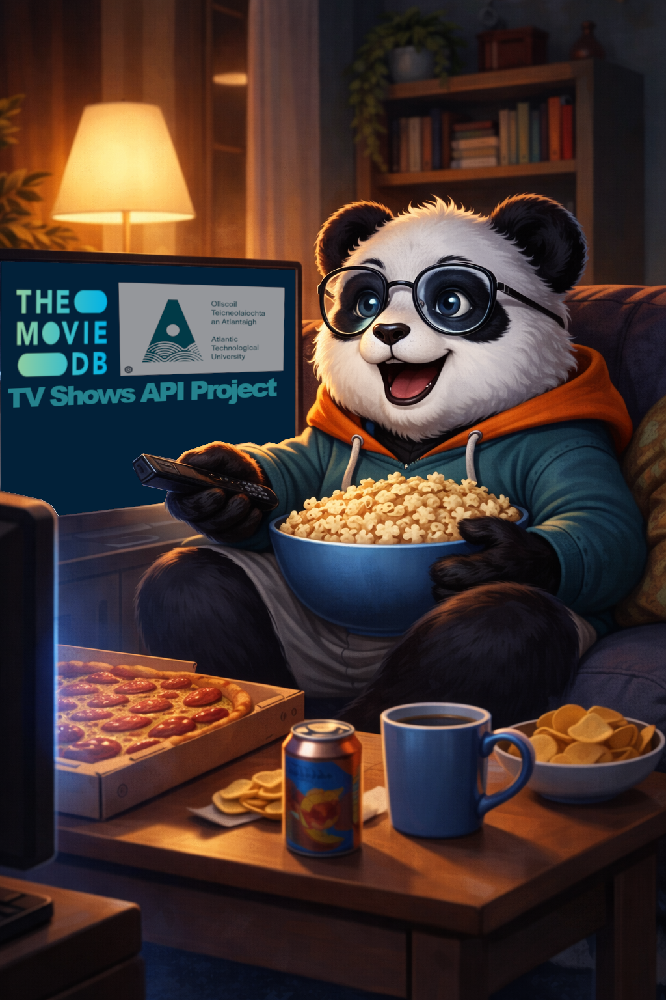
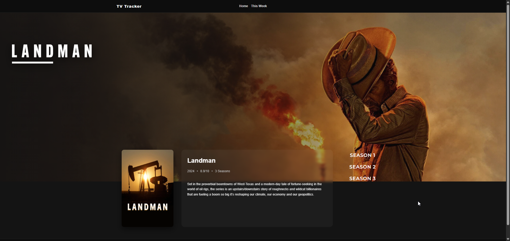

# 8640-web_services_and_applications
# RESTful API Project

  

Welcome to the Repository for Big Project Work assigned on ATU Module **25-26: 8640 -- Web Services and Applications**   
 
The subject of this RESTful API Project will be **Television Shows**.  
This is driven by a long-term personal love of the subject.  
Television Shows have been chosen over **Movies** as they present a greater technical challenge, particularly in handling hierarchical relationships between Shows, Seasons, and Episodes (and that I watch more TV Shows than Movies).  
  
There are numerous API services available that provide structured data on TV Shows ... including seasons, episodes, cast, and production details  
* TMDB (the Movie Database)
* OMDb API
* IMDB
* The TVDB API
* Trakt API (used for managing your personal "watched" list)  

This project makes extensive use of the TMDB and Trakt API Services.  
https://www.themoviedb.org/  
https://app.trakt.tv/   

***
## Project Objectives  
With the wide range of television content currently available, I have relied on the **Trakt** service to track shows I have watched and to also maintain a list of those I intend to watch.  
This "Watch" list from Trakt will form the basis for a database of TV Shows data (including  associated Seasons, Episodes, Cast, and Crew)  
A RESTful API will be created to provide access to this Database of TV Shows  
Finally, a graphical Web Application will be created to display the data in this Database.  

I will initially ...  
* Use the Trakt API to get my watch history collection. 
* Based on data extracted from Trakt, I will then use the TMDB API to get the full Show/Season/Episode/Cast metadata details
* Feed this TMDB Data into a MySQL based database
* Develop a RESTful API to allow users interact with the data on this Database

A collection of Notebooks with extended details on using the Trakt and TMDB API, the Data Model, scheduled jobs, and the final Web Application.   https://ngnwatchs.pythonanywhere.com/shows  

[Trakt API](notebooks/trakt_api.ipynb)  
[TMDB API](notebooks/tmdb_api.ipynb)  
[MySQL Data Model](notebooks/data_model.ipynb)  
[Scheduled Jobs](notebooks/scheduled_jobs.ipynb)  
[Web Application](notebooks/web_application.ipynb)  

 

